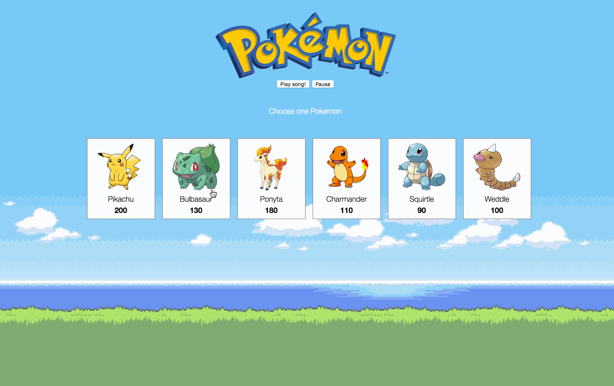

## :fire: Pokemon RPG Game :fire:
UC Berkeley - Coding Bootcamp Project

## Overview

This is a classic RPG. When the game starts, the player will choose a character by clicking on the pokemon's picture. The player will fight as that pokemon for the rest of the game.

## Built with

* HTML
* CSS
* JavaScript and jQuery

